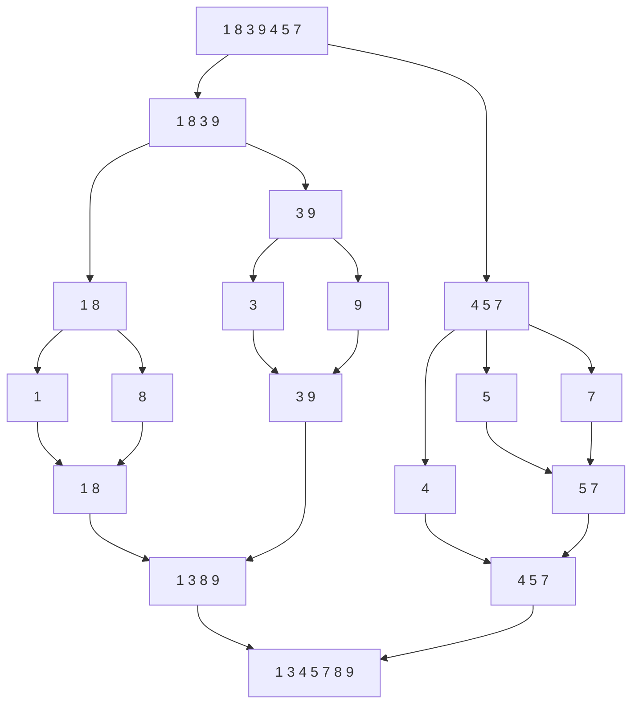

## Merge sort

**Merge sort** is a popular sorting algorithm, used to sort big datasets. It is rather easy to understand.  
It is a stable sorting algorithm, with *time complexity* of `O(Nlog(N))`. It does also take some extra space  
to split the array up to 2 subarrays then sort and merge them back together.

Here is a chart below to explain the algorithm:

### Some *advantages* of **merge sort** are:

#### 1. It is a stable sorting algorithm:
Meaning it makes sure the order of the same elements remain the same after sorting.

#### 2. Guranteed worst case time complexity:
**Merge sort** has worst case *time complexity* of `O(Nlog(N))`, unlike **quick sort** which has worst case   
*time complexity* of `O(N^2)`, which can lead to poor performance in large datasets.

### Some *disadvantages* of **merge sort** are:

#### 1. It is not optimal for small datasets:
For small datasets, when size of it is equal to or less than `43`, **insertion sort** performs way better.

#### 2. Space complexity:
This algorithm takes extra space to contain 2 subarrays. On limited memory resources this algorithm is not great.

**Refereces**:

1. [Merge Sort Algorithm](https://www.geeksforgeeks.org/merge-sort/)
2. [Stability in Sorting Algorithms — A Treatment of Equality](https://www.freecodecamp.org/news/stability-in-sorting-algorithms-a-treatment-of-equality-fa3140a5a539/)
